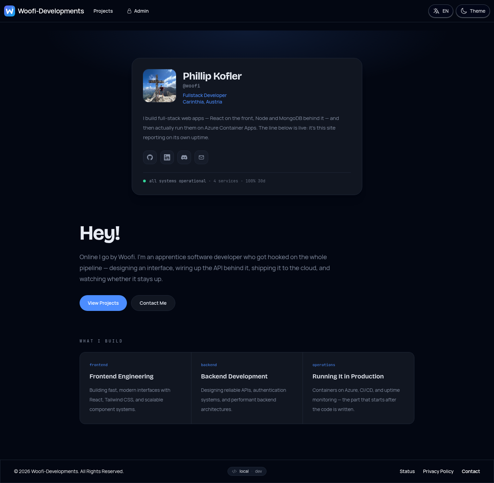
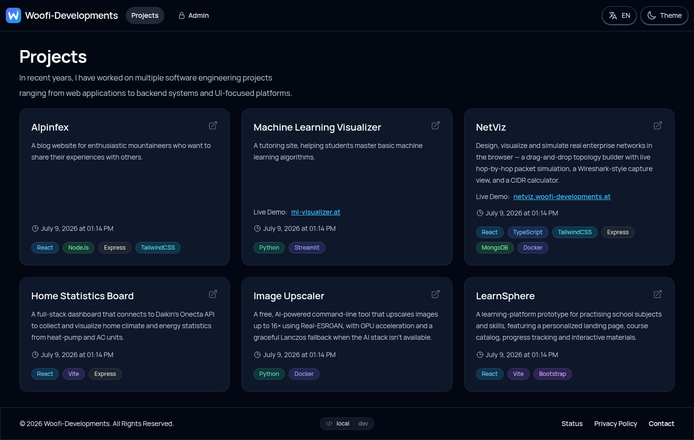
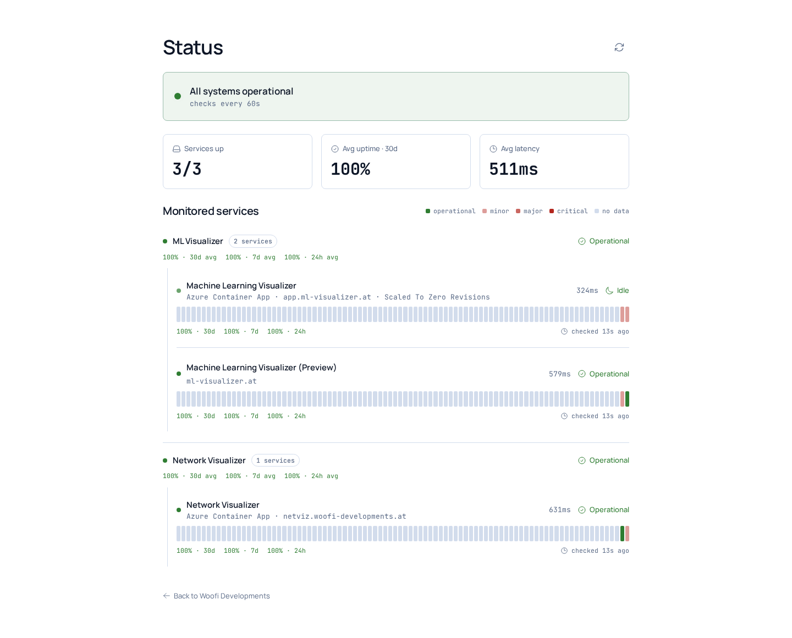
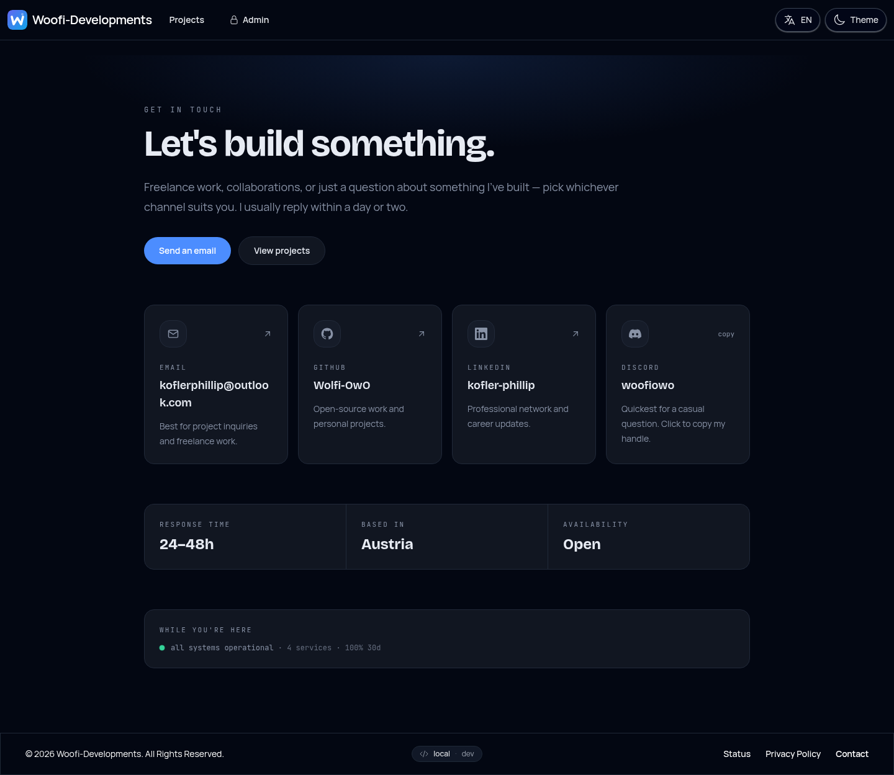

<div align="center">

# Woofi Developments — Portfolio Website

My personal developer portfolio: projects, skills, background, and a live status page for monitoring uptime.

[](https://github.com/Wolfi-OwO/portfolio-webpage/actions/workflows/linting.yml)
[](https://github.com/Wolfi-OwO/portfolio-webpage/actions/workflows/ci.yml)
[](https://github.com/Wolfi-OwO/portfolio-webpage/releases/latest)
[](https://github.com/Wolfi-OwO/portfolio-webpage/actions/workflows/secret-detection.yml)
[](./LICENSE)


</div>



## Features

### Projects



- Bilingual (EN/DE) UI with light/dark/system theme switching.
- Project showcase backed by a CRUD API — title, description, repo/live-demo links, color-coded technology tags.
- Admin-only inline editing: sign in and add/edit/delete projects directly from the page.

### Live Status Page



- Add any URL as a monitor; a background job checks it on a fixed interval (default 60s) and writes results to MongoDB, building a 24/7 uptime history (90-day retention).
- Public, Discord-style status page served on its own `status.` subdomain from a separate, minimal Vite bundle — visiting it doesn't download the whole app just to show uptime.
- Per-monitor 24h / 7d / 30d uptime percentages and a scrolling history bar.

### Contact



- Direct links for email, GitHub and LinkedIn, plus a quick summary of services offered.

## Local Development

To run the website locally, follow these steps:

1. Clone the repository:

   ```bash
   git clone https://github.com/Wolfi-OwO/portfolio-webpage.git
    cd portfolio-webpage
   ```

2. Install dependencies (Server and Client):

   ```bash
    cd application/server
    npm install

    cd ../client
    npm install
    ```

3. Start the mongo database (docker):

   ```bash
    docker run -d -p 27017:27017 --name portfolio-mongo mongo
   ```

4. Build the client application (from `application/client`):

   ```bash
    npm run build
   ```

5. Start the server (from `application/server`):

   ```bash
    cd ../server
    npm start
   ```

In order to test the backend, you can run the tests using (from `application/server`):

1. Start the mongo database (docker):

   ```bash
    docker run -d -p 50000:27017 --name portfolio-mongo-test mongo
   ```

2. Run the tests:

    ```bash
    npm test
    ```

## Authentication

The API uses JWT-based authorization. Reading projects and technologies is public; creating, updating, and deleting them requires a valid `Bearer` token.

### Obtaining a token

```bash
curl -X POST http://localhost:8080/auth/login \
  -H 'Content-Type: application/json' \
  -d '{"username":"admin","password":"admin"}'
```

Response:

```json
{ "token": "<jwt>", "expiresIn": "1h" }
```

### Endpoint matrix

| Method | Path                       | Auth required |
| ------ | -------------------------- | ------------- |
| POST   | `/auth/login`              | no            |
| GET    | `/api/projects`            | no            |
| GET    | `/api/projects/:id`        | no            |
| POST   | `/api/projects`            | yes           |
| PUT    | `/api/projects/:id`        | yes           |
| DELETE | `/api/projects/:id`        | yes           |
| GET    | `/api/technologies`        | no            |
| GET    | `/api/technologies/:id`    | no            |
| POST   | `/api/technologies`        | yes           |
| PUT    | `/api/technologies/:id`    | yes           |
| DELETE | `/api/technologies/:id`    | yes           |

### Calling a protected endpoint

```bash
curl -X POST http://localhost:8080/api/technologies \
  -H 'Authorization: Bearer <jwt>' \
  -H 'Content-Type: application/json' \
  -d '{"tech":"Rust","color":"bg-orange-100 text-orange-800"}'
```

Unauthenticated or expired-token requests return `401 Unauthorized`.

## Live Demo

The live version of the website can be accessed at: [https://woofi-developments.at](https://woofi-developments.at)

## Purpose

The goal of this website is to:

- Present my software development projects
- Highlight my technical skills and experience
- Provide a central place for contact and collaboration
- Serve as a foundation for freelance and professional opportunities

## Tech Stack

The website is built using the following technologies:

- React (JavaScript) for the frontend
- Tailwind CSS for styling
- Node.js (for tooling / backend integration)
- Microsoft Azure (deployment)

## Project Structure

`application/` holds three independent deployables — `server/` (the Express API), `client/` (the React frontend) and `monitor-checker/` (an Azure Function that pings monitored URLs on a schedule) — each with its own `package.json`. The structure is organized as follows:

```txt
├── application
│   ├── server
│   │   ├── src
│   │   │   ├── database
│   │   │   ├── handlers
│   │   │   ├── middlewares
│   │   │   ├── models
│   │   │   ├── routes
│   │   │   ├── utils
│   │   │   └── server.js
│   │   ├── tests
│   │   ├── package.json
│   │   ├── package-lock.json
│   │   ├── dockerfile
│   │   └── eslint.config.js
│   ├── client
│   └── monitor-checker
├── LICENSE
└── README.md
```

- `server/src/database/`: MongoDB connection setup and demo-data seeding
- `server/src/handlers/`: Request handlers for the backend
- `server/src/middlewares/`: Auth, error-handling and other Express middleware
- `server/src/models/`: Mongoose data models and schemas
- `server/src/routes/`: API route definitions
- `server/src/utils/`: Utility functions and helpers (logging, health checks, the status-page monitor checker)
- `server/src/server.js`: Entry point for the backend server
- `server/tests/`: Unit and integration tests
- `server/dockerfile`: Instructions for building the backend's Docker image
- `client/`: The React frontend application (default Vite setup)
- `monitor-checker/`: A standalone Azure Function (Timer Trigger) that performs the actual uptime pings — see below
