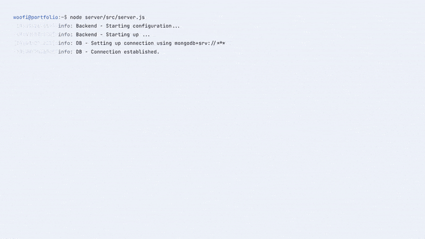

<div align="center">

# Woofi Developments — Portfolio Website

My personal developer portfolio: projects, skills, background, and a live status page for monitoring uptime.

[](https://github.com/Wolfi-OwO/portfolio-webpage/actions/workflows/linting.yml)
[](https://github.com/Wolfi-OwO/portfolio-webpage/actions/workflows/ci.yml)
[](https://github.com/Wolfi-OwO/portfolio-webpage/releases/latest)
[](https://github.com/Wolfi-OwO/portfolio-webpage/actions/workflows/secret-detection.yml)
[](./LICENSE)




<sub>The clip above is 50 fps — the ceiling GIF can actually hold. The same walkthrough recorded at a true 60 fps: <a href="docs/demo.mp4">MP4</a> · <a href="docs/demo.webm">WebM</a></sub>

</div>

## Features

### Home


- A profile card that doubles as a service card: it reads the same `/api/status` the status page uses, so the hero reports this site's own live uptime instead of hand-written stats.
- Social links for GitHub, LinkedIn, Discord and email — Discord copies the handle, since a Discord username isn't a URL.

### Projects


- Bilingual (EN/DE) UI with light/dark/system theme switching.
- Project showcase backed by a CRUD API — title, description, repo/live-demo links, color-coded technology tags.
- Admin-only inline editing: sign in and add/edit/delete projects directly from the page.

### Live Status Page


- Checks run 24/7 in a standalone Azure Function (Timer trigger, once a minute) that writes each result to MongoDB; the web app only _reads_ that history, building a 90-day uptime record.
- Azure Container Apps are checked from the control plane — never over HTTP, because a request would wake a scale-to-zero app. The checker reads the latest active, non-PR revision and reports its running state.
- A scale-to-zero app that's idle shows as **Idle**, not Down — it's healthy and available on demand, so it doesn't dent uptime.
- Public, Discord-style status page served on its own `status.` subdomain from a separate, minimal Vite bundle — visiting it doesn't download the whole app just to show uptime.
- Per-monitor 24h / 7d / 30d uptime percentages and a scrolling history bar.

### Contact


- One card per channel: email, GitHub, LinkedIn and Discord, plus response time and availability at a glance.

## Local Development

To run the website locally, follow these steps:

1. Clone the repository:

   ```bash
   git clone https://github.com/Wolfi-OwO/portfolio-webpage.git
    cd portfolio-webpage
   ```

2. Install dependencies (Server and Client):

   ```bash
    cd application/server
    npm install

    cd ../client
    npm install
   ```

3. Start the mongo database (docker):

   ```bash
    docker run -d -p 27017:27017 --name portfolio-mongo mongo
   ```

4. Build the client application (from `application/client`):

   ```bash
    npm run build
   ```

5. Start the server (from `application/server`):

   ```bash
    cd ../server
    npm start
   ```

In order to test the backend, you can run the tests using (from `application/server`):

1. Start the mongo database (docker):

   ```bash
    docker run -d -p 50000:27017 --name portfolio-mongo-test mongo
   ```

2. Run the tests:

   ```bash
   npm test
   ```

## Authentication

The API uses JWT-based authorization. Reading projects and technologies is public; creating, updating, and deleting them requires a valid `Bearer` token.

### Obtaining a token

```bash
curl -X POST http://localhost:8080/auth/login \
  -H 'Content-Type: application/json' \
  -d '{"username":"admin","password":"admin"}'
```

Response:

```json
{ "token": "<jwt>", "expiresIn": "1h" }
```

### Endpoint matrix

| Method | Path                    | Auth required |
| ------ | ----------------------- | ------------- |
| POST   | `/auth/login`           | no            |
| GET    | `/api/projects`         | no            |
| GET    | `/api/projects/:id`     | no            |
| POST   | `/api/projects`         | yes           |
| PUT    | `/api/projects/:id`     | yes           |
| DELETE | `/api/projects/:id`     | yes           |
| GET    | `/api/technologies`     | no            |
| GET    | `/api/technologies/:id` | no            |
| POST   | `/api/technologies`     | yes           |
| PUT    | `/api/technologies/:id` | yes           |
| DELETE | `/api/technologies/:id` | yes           |

### Calling a protected endpoint

```bash
curl -X POST http://localhost:8080/api/technologies \
  -H 'Authorization: Bearer <jwt>' \
  -H 'Content-Type: application/json' \
  -d '{"tech":"Rust","color":"bg-orange-100 text-orange-800"}'
```

Unauthenticated or expired-token requests return `401 Unauthorized`.

## Live Demo

The live version of the website can be accessed at: [https://woofi-developments.at](https://woofi-developments.at)

## Purpose

The goal of this website is to:

- Present my software development projects
- Highlight my technical skills and experience
- Provide a central place for contact and collaboration
- Serve as a foundation for freelance and professional opportunities

## Tech Stack

The website is built using the following technologies:

- React (JavaScript) for the frontend
- Tailwind CSS for styling
- Node.js (for tooling / backend integration)
- Microsoft Azure (deployment)

## Project Structure

Everything that runs lives under `application/`, which is an npm workspace. It holds three independent deployables — `server/` (the Express API), `client/` (the React frontend) and `jobs/` (Azure Functions on a timer) — each with its own `package.json`.

```txt
├── application
│   ├── package.json          workspace root — tooling only, no application code
│   ├── package-lock.json     one lockfile for server + client
│   ├── dockerfile
│   ├── docker-compose.yaml
│   ├── scripts
│   │   └── sync-version.mjs  stamps the git tag into every package.json
│   ├── server
│   │   ├── src
│   │   │   ├── database
│   │   │   ├── handlers
│   │   │   ├── middlewares
│   │   │   ├── models
│   │   │   ├── routes
│   │   │   ├── utils
│   │   │   └── server.js
│   │   ├── tests
│   │   └── package.json
│   ├── client
│   │   └── package.json
│   └── jobs
│       ├── src/functions     checkMonitors, syncContributions
│       ├── package.json
│       └── package-lock.json its own — see below
├── .github                   workflows, issue/PR templates, dependabot
├── CONTRIBUTING.md
├── LICENSE
└── README.md
```

**Why `jobs/` is not in the workspace.** `server` and `client` share one install and one lockfile — they are built together into a single image. `jobs` is deliberately left out: the Azure Functions deploy zips that folder _including its `node_modules`_, and a hoisted workspace install would hand Azure a package with no dependencies in it. So it keeps its own lockfile and is installed on its own (`npm ci --prefix jobs`).

- `server/src/database/`: MongoDB connection setup and demo-data seeding
- `server/src/handlers/`: Request handlers for the backend
- `server/src/middlewares/`: Auth, error-handling and other Express middleware
- `server/src/models/`: Mongoose data models and schemas
- `server/src/routes/`: API route definitions
- `server/src/utils/`: Utility functions and helpers (logging, health checks)
- `server/src/server.js`: Entry point for the backend server — also serves `client/dist`
- `server/tests/`: Unit and integration tests
- `client/`: The React frontend (Vite, Tailwind, react-intl)
- `jobs/`: Azure Functions (Timer Triggers) — uptime pings for the status page, and the GitHub/GitLab contribution sync the heatmap reads from
- `dockerfile`: Builds the backend image. The build context is `application/`, so it can copy the workspace lockfile, `server/` and the pre-built `client/dist`
- `docker-compose.yaml`: Local stack (web, MongoDB, Azurite, jobs) — run `docker compose` from `application/`
- `scripts/sync-version.mjs`: Writes the release tag into every `package.json`, so the four never drift apart
