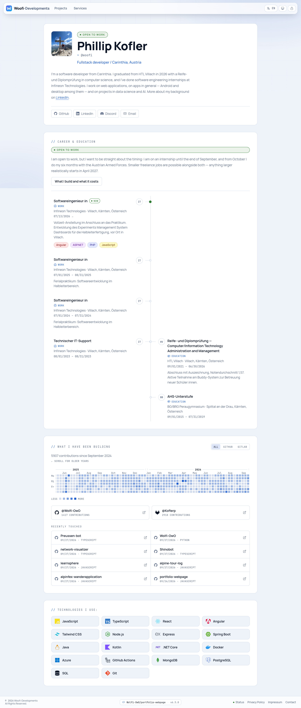
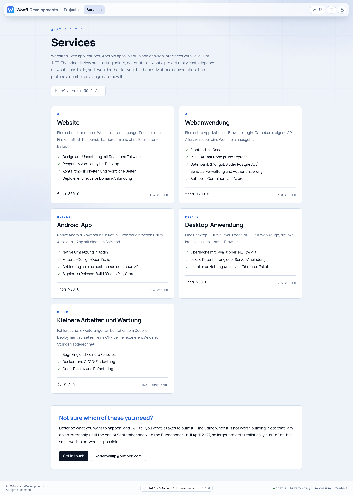

<div align="center">

# Woofi Developments — Portfolio Website

My personal developer portfolio: projects, skills, background, and a live status page for monitoring uptime.

[](https://github.com/Wolfi-OwO/portfolio-webpage/actions/workflows/linting.yml)
[](https://github.com/Wolfi-OwO/portfolio-webpage/actions/workflows/ci.yml)
[](https://github.com/Wolfi-OwO/portfolio-webpage/releases/latest)
[](https://github.com/Wolfi-OwO/portfolio-webpage/actions/workflows/secret-detection.yml)
[](./LICENSE)


Live at [woofi-developments.at](https://woofi-developments.at) — status at [status.woofi-developments.at](https://status.woofi-developments.at)


<sub>The clip above is 50 fps — the ceiling GIF can actually hold. The same walkthrough recorded at a true 60 fps: <a href="docs/demo.mp4">MP4</a> · <a href="docs/demo.webm">WebM</a></sub>

</div>

## Features

### Home



- A profile card that doubles as a service card: it reads the same `/api/status` the status page uses, so the hero reports this site's own live uptime instead of hand-written stats.
- Social links for GitHub, LinkedIn, Discord and email — Discord copies the handle, since a Discord username isn't a URL.

### Career


- A timeline of work and education blocks on the homepage, drawn from `startDate`/`endDate` on each entry rather than a hand-maintained "current" flag — which block reads as ongoing is decided by today's date.
- Backed by the same `/api/availability` collection that drives the availability badge next to it, filtered to the career track (`?track=career`); admin-only inline add/edit/delete.

### Projects


- Bilingual (EN/DE) UI with light/dark/system theme switching.
- Project showcase backed by a CRUD API — title, description, repo/live-demo links, color-coded technology tags.
- Admin-only inline editing: sign in and add/edit/delete projects directly from the page.

### Services



- What I offer, grouped into web/mobile/desktop/other, each with its deliverables, starting price and hourly rate.
- Backed by its own CRUD API (`/api/services`); admin-only inline add/edit/delete, same pattern as Projects.

### Live Status Page


- Checks run 24/7 in a separate Azure Function (Timer trigger, once a minute) that writes each result to MongoDB; this web app only _reads_ that history. MongoDB keeps a rolling 90-day window — the 24h/7d/30d figures below live entirely inside it — but up/down and response time are also copied into Metrion, a second, self-hosted system of mine with no fixed deletion date, so the availability history survives past 90 days there.
- Per monitor, the checker either sends a plain HTTP ping (this site's own domains, now on the VPS) or reads the app's state straight from the Azure control plane — never over HTTP — for whatever still runs as an Azure Container App, because a request would wake a scale-to-zero app.
- A scale-to-zero app that's idle shows as **Idle**, not Down — it's healthy and available on demand, so it doesn't dent uptime.
- Public, Discord-style status page served on its own `status.` subdomain from a separate, minimal Vite bundle — visiting it doesn't download the whole app just to show uptime.
- Per-monitor 24h / 7d / 30d uptime percentages and a scrolling history bar.

### Incidents


- A dedicated `/incidents` page on the status bundle, listing every recorded incident across all monitors, newest first and grouped by day — drawing on the same combined MongoDB + Metrion history as the status page, so an incident older than MongoDB's 90-day window still shows up.

### Contact


- One card per channel: email, GitHub, LinkedIn and Discord, plus response time and availability at a glance.

## Why it is built this way

- The status checker is decoupled from the reader: a separate Azure Function writes every check, and this app only reads the history it produces — so a checker crash or slowdown never blocks the site.
- Whatever still lives as an Azure Container App is checked from the control plane, never over HTTP, because a request would wake a scale-to-zero app and defeat the reason it's checked that way.
- Idle is not Down for a scale-to-zero app — it's healthy and available on demand, so idle time doesn't count against uptime.
- The status page ships as its own bundle on the `status.` subdomain, so visiting it never costs downloading the full portfolio app.

## Tech stack

The website is built using the following technologies:

- React (JavaScript) for the frontend, built with Vite and styled with Tailwind CSS
- Node.js / Express for the backend API, MongoDB (Mongoose) for storage
- Deployed on a Contabo VPS behind Caddy, as blue-green Docker Compose containers (`web-blue` / `web-green`) — Caddy terminates TLS and reverse-proxies to whichever slot is currently live
- The uptime-check job still runs as a separate Azure Function App

## Getting started

To run the website locally, follow these steps:

1. Clone the repository:

   ```bash
   git clone https://github.com/Wolfi-OwO/portfolio-webpage.git
   cd portfolio-webpage
   ```

2. Install dependencies — `application/` is an npm workspace covering `server` and `client`, so one install covers both:

   ```bash
   cd application
   npm install
   ```

3. Start the mongo database (docker):

   ```bash
   docker run -d -p 27017:27017 --name portfolio-mongo mongo
   ```

4. Build the client application (from `application`):

   ```bash
   npm run build
   ```

5. Start the server (from `application`):

   ```bash
   npm start
   ```

In order to test the backend, you can run the tests using (from `application/server`):

1. Start the mongo database (docker):

   ```bash
   docker run -d -p 50000:27017 --name portfolio-mongo-test mongo
   ```

2. Run the tests:

   ```bash
   npm test
   ```

## Project structure

Everything that runs lives under `application/`, which is an npm workspace. It holds three independent deployables — `server/` (the Express API), `client/` (the React frontend) and `jobs/` (Azure Functions on a timer) — each with its own `package.json`.

```txt
├── application
│   ├── package.json          workspace root — tooling only, no application code
│   ├── package-lock.json     one lockfile for server + client
│   ├── dockerfile
│   ├── docker-compose.yaml
│   ├── docker-compose.prod.yaml  the VPS stack — Caddy + blue-green web-blue/web-green
│   ├── Caddyfile              production reverse-proxy config for the VPS
│   ├── scripts
│   │   └── sync-version.mjs  stamps the git tag into every package.json
│   ├── server
│   │   ├── src
│   │   │   ├── database
│   │   │   ├── handlers
│   │   │   ├── middlewares
│   │   │   ├── models
│   │   │   ├── routes
│   │   │   ├── utils
│   │   │   └── server.js
│   │   ├── tests
│   │   └── package.json
│   ├── client
│   │   └── package.json
│   └── jobs
│       ├── src/functions     checkMonitors, syncContributions
│       ├── package.json
│       └── package-lock.json its own — see below
├── .github                   workflows, issue/PR templates, dependabot
├── CONTRIBUTING.md
├── LICENSE
└── README.md
```

**Why `jobs/` is not in the workspace.** `server` and `client` share one install and one lockfile — they are built together into a single image. `jobs` is deliberately left out: the Azure Functions deploy zips that folder _including its `node_modules`_, and a hoisted workspace install would hand Azure a package with no dependencies in it. So it keeps its own lockfile and is installed on its own (`npm ci --prefix jobs`).

**How `jobs/` actually deploys today.** The web app (`server` + `client`) moved to the Contabo VPS and runs there as blue-green Docker Compose containers behind Caddy. `jobs/` did not move with it — it still deploys as a native Azure Function App (`woofi-monitor-checker`, `functionapp,linux`, zip deploy), separate from any container image. `docker-compose.prod.yaml` on the VPS carries a matching `jobs` service, but it is disabled (`profiles: ['jobs']`) because no `portfolio-jobs` image has ever been pushed to the registry — it starts the moment one exists and that key is removed. Each check the Function performs is either a plain HTTP ping (for anything that has moved off Azure, like this site itself) or a read of the Azure control plane (for anything still running as a Container App) — see `resolveCheckMode` in `application/jobs/src/functions/checkMonitors.js`.

- `server/src/database/`: MongoDB connection setup and demo-data seeding
- `server/src/handlers/`: Request handlers for the backend
- `server/src/middlewares/`: Auth, error-handling and other Express middleware
- `server/src/models/`: Mongoose data models and schemas
- `server/src/routes/`: API route definitions
- `server/src/utils/`: Utility functions and helpers (logging, health checks)
- `server/src/server.js`: Entry point for the backend server — also serves `client/dist`
- `server/tests/`: Unit and integration tests
- `client/`: The React frontend (Vite, Tailwind, react-intl)
- `jobs/`: Azure Functions (Timer Triggers) — uptime pings/control-plane checks for the status page, and the GitHub/GitLab contribution sync the heatmap reads from
- `dockerfile`: Builds the backend image. The build context is `application/`, so it can copy the workspace lockfile, `server/` and the pre-built `client/dist`
- `docker-compose.yaml`: Local stack (web, MongoDB, Azurite, jobs) — run `docker compose` from `application/`
- `docker-compose.prod.yaml`: The VPS stack — Caddy, `web-blue`/`web-green`, Azurite, and the (currently disabled) `jobs` service
- `scripts/sync-version.mjs`: Writes the release tag into every `package.json`, so the four never drift apart

## API reference

The API uses JWT-based authorization. `/api/projects`, `/api/technologies`, `/api/services`, `/api/availability`, `/api/activity`, `/api/status` and `/api/secret/voucher` (with the right token) are readable without one; `/api/monitors` is admin-only for every verb; creating, updating and deleting anywhere always requires a valid `Bearer` token.

Every JSON response carries an `_links` object (HATEOAS, REST maturity level 3) — a client can start at `GET /api` and follow links from there instead of hardcoding every path. The three exceptions are the binary voucher download, any `204 No Content` response (nothing to attach links to), and error bodies (kept in a fixed, link-free shape so a client can rely on it). Every route below also answers `HEAD` (same as `GET`, but with the body stripped and, for the voucher, without the file transfer that a real `GET` does) and `OPTIONS` (`200`, with an `Allow` header listing the verbs that route actually supports) — this is Express 5's own built-in behavior, not something this API adds. `POST` endpoints that create a resource answer `201 Created` with a `Location` header pointing at it. A `GET` by id answers `404` for a well-formed id that doesn't exist, and `400` for a malformed one.

#### API root

The hypermedia entry point — one call to discover every other resource, so nothing below has to be hardcoded.

**`GET /api`** — public, responds to `HEAD` and `OPTIONS` like every other endpoint.

```bash
curl http://localhost:8080/api
```

```json
{
  "name": "Portfolio Webpage API",
  "version": "dev",
  "_links": {
    "self": { "href": "/api" },
    "info": { "href": "/api/info" },
    "projects": { "href": "/api/projects" },
    "technologies": { "href": "/api/technologies" },
    "services": { "href": "/api/services" },
    "availability": { "href": "/api/availability" },
    "activity": { "href": "/api/activity" },
    "status": { "href": "/api/status" },
    "monitors": { "href": "/api/monitors" },
    "login": { "href": "/auth/login", "method": "POST" },
    "unlock": { "href": "/auth/unlock", "method": "POST" }
  }
}
```

#### Auth

Issues and ends the JWTs every write, and every `/api/monitors` request, depends on. Responds to `HEAD` and `OPTIONS` like every other endpoint.

**`POST /auth/login`** — no auth required. Checks the submitted username/password against the `ADMIN_USER` / `ADMIN_PASSWORD_HASH` environment variables (a bcrypt hash), both required at boot. There is no seeded `admin`/`admin` account.

```bash
curl -X POST http://localhost:8080/auth/login \
  -H 'Content-Type: application/json' \
  -d '{"username":"<ADMIN_USER value>","password":"<the plaintext ADMIN_PASSWORD_HASH was hashed from>"}'
```

```json
{
  "token": "<jwt>",
  "expiresIn": "1h",
  "_links": {
    "root": { "href": "/api" },
    "logout": { "href": "/auth/logout", "method": "POST" }
  }
}
```

**`POST /auth/unlock`** — no auth required, but password-gated. Checks the same admin password and issues a much narrower `secret`-scoped token that only opens the voucher download, not any admin route.

```bash
curl -X POST http://localhost:8080/auth/unlock \
  -H 'Content-Type: application/json' \
  -d '{"password":"<the plaintext ADMIN_PASSWORD_HASH was hashed from>"}'
```

```json
{
  "token": "<jwt>",
  "expiresIn": "30m",
  "_links": {
    "voucher": { "href": "/api/secret/voucher" }
  }
}
```

**`POST /auth/logout`** — requires an admin token. Tokens are stateless and not tracked server-side, so this has nothing to revoke; it exists so the frontend has a symmetric call and a bad/missing token is reported the same way `authMiddleware` reports it everywhere else. Answers `204 No Content` — no body, so no `_links`.

```bash
curl -X POST http://localhost:8080/auth/logout -H 'Authorization: Bearer <jwt>'
```

#### Info

Build metadata (version, repository, revision, build date) for the footer's build-info chip.

**`GET /api/info`** — public.

```bash
curl http://localhost:8080/api/info
```

```json
{
  "version": "dev",
  "repositoryUrl": "",
  "revision": "",
  "buildDate": "",
  "_links": {
    "self": { "href": "/api/info" },
    "root": { "href": "/api" }
  }
}
```

#### Projects

The project showcase on `/projects`, each with an embeddable list of technologies.

**`GET /api/projects`** — public. Supports `?sort=`, `?limit=`, `?offset=`, `?embed=(technologies)` and field filters. `_links.self` preserves whatever query string was sent.

```bash
curl 'http://localhost:8080/api/projects?embed=(technologies)'
```

```json
{
  "_links": {
    "self": { "href": "/api/projects?embed=(technologies)" },
    "create": { "href": "/api/projects", "method": "POST" }
  },
  "count": 1,
  "items": [
    {
      "_id": "6aba42da2566d674aa973c19",
      "title": "Portfolio Website",
      "description": "A developer portfolio and live status page.",
      "repositoryUrl": "https://github.com/Wolfi-OwO/portfolio-webpage",
      "livedemo": "https://woofi-developments.at",
      "technologies": [],
      "createdAt": "2026-09-28T10:35:06.971Z",
      "updatedAt": "2026-09-28T10:35:06.971Z",
      "_links": {
        "self": { "href": "/api/projects/6aba42da2566d674aa973c19" },
        "update": { "href": "/api/projects/6aba42da2566d674aa973c19", "method": "PUT" },
        "delete": { "href": "/api/projects/6aba42da2566d674aa973c19", "method": "DELETE" },
        "collection": { "href": "/api/projects" }
      }
    }
  ]
}
```

**`GET /api/projects/:id`** — public. `404` if the id is well-formed but nothing matches; `400` if the id itself is malformed.

```bash
curl http://localhost:8080/api/projects/6aba42da2566d674aa973c19
```

```json
{
  "_id": "6aba42da2566d674aa973c19",
  "title": "Portfolio Website",
  "description": "A developer portfolio and live status page.",
  "repositoryUrl": "https://github.com/Wolfi-OwO/portfolio-webpage",
  "livedemo": "https://woofi-developments.at",
  "technologies": [],
  "_links": {
    "self": { "href": "/api/projects/6aba42da2566d674aa973c19" },
    "update": { "href": "/api/projects/6aba42da2566d674aa973c19", "method": "PUT" },
    "delete": { "href": "/api/projects/6aba42da2566d674aa973c19", "method": "DELETE" },
    "collection": { "href": "/api/projects" }
  }
}
```

**`POST /api/projects`** — requires an admin token. Answers `201 Created` with `Location` set to the new project.

```bash
curl -i -X POST http://localhost:8080/api/projects \
  -H 'Authorization: Bearer <jwt>' \
  -H 'Content-Type: application/json' \
  -d '{"title":"Portfolio Website","description":"A developer portfolio and live status page.","repositoryUrl":"https://github.com/Wolfi-OwO/portfolio-webpage"}'
```

```
HTTP/1.1 201 Created
Location: /api/projects/6aba42da2566d674aa973c19
```

```json
{
  "_id": "6aba42da2566d674aa973c19",
  "title": "Portfolio Website",
  "description": "A developer portfolio and live status page.",
  "repositoryUrl": "https://github.com/Wolfi-OwO/portfolio-webpage",
  "technologies": [],
  "_links": {
    "self": { "href": "/api/projects/6aba42da2566d674aa973c19" },
    "update": { "href": "/api/projects/6aba42da2566d674aa973c19", "method": "PUT" },
    "delete": { "href": "/api/projects/6aba42da2566d674aa973c19", "method": "DELETE" },
    "collection": { "href": "/api/projects" }
  }
}
```

**`PUT /api/projects/:id`** — requires an admin token. `404`/`400` follow the same rule as the `GET` by id.

```bash
curl -X PUT http://localhost:8080/api/projects/6aba42da2566d674aa973c19 \
  -H 'Authorization: Bearer <jwt>' \
  -H 'Content-Type: application/json' \
  -d '{"livedemo":"https://woofi-developments.at"}'
```

```json
{
  "_id": "6aba42da2566d674aa973c19",
  "title": "Portfolio Website",
  "livedemo": "https://woofi-developments.at",
  "_links": {
    "self": { "href": "/api/projects/6aba42da2566d674aa973c19" },
    "update": { "href": "/api/projects/6aba42da2566d674aa973c19", "method": "PUT" },
    "delete": { "href": "/api/projects/6aba42da2566d674aa973c19", "method": "DELETE" },
    "collection": { "href": "/api/projects" }
  }
}
```

**`DELETE /api/projects/:id`** — requires an admin token. Answers `204 No Content` on success; no body, no `_links`.

```bash
curl -X DELETE http://localhost:8080/api/projects/6aba42da2566d674aa973c19 -H 'Authorization: Bearer <jwt>'
```

#### Technologies

The `{tech, color}` tags projects and career entries are tagged with — a shared vocabulary rather than free text on each project.

**`GET /api/technologies`** / **`GET /api/technologies/:id`** — public, same list/item/`404`/`400` shape as projects.

```bash
curl http://localhost:8080/api/technologies
```

```json
{
  "_links": {
    "self": { "href": "/api/technologies" },
    "create": { "href": "/api/technologies", "method": "POST" }
  },
  "count": 1,
  "items": [
    {
      "_id": "6aba42da2566d674aa973c18",
      "tech": "React",
      "color": "bg-sky-100 text-sky-800 dark:bg-sky-500/20 dark:text-sky-300",
      "_links": {
        "self": { "href": "/api/technologies/6aba42da2566d674aa973c18" },
        "update": { "href": "/api/technologies/6aba42da2566d674aa973c18", "method": "PUT" },
        "delete": { "href": "/api/technologies/6aba42da2566d674aa973c18", "method": "DELETE" },
        "collection": { "href": "/api/technologies" }
      }
    }
  ]
}
```

**`POST /api/technologies`** — requires an admin token. `201` + `Location`.

```bash
curl -i -X POST http://localhost:8080/api/technologies \
  -H 'Authorization: Bearer <jwt>' \
  -H 'Content-Type: application/json' \
  -d '{"tech":"React","color":"bg-sky-100 text-sky-800 dark:bg-sky-500/20 dark:text-sky-300"}'
```

```
HTTP/1.1 201 Created
Location: /api/technologies/6aba42da2566d674aa973c18
```

**`PUT /api/technologies/:id`** / **`DELETE /api/technologies/:id`** — both require an admin token. `PUT` returns the updated technology with `_links`; `DELETE` answers `204 No Content`.

#### Services

The pricing cards on `/services` — what I build and what it starts at.

**`GET /api/services`** / **`GET /api/services/:id`** — public reads, but `optionalAuth`: an anonymous caller only ever sees `published: true` entries; a valid admin token also sees drafts. The README used to describe this as admin-only — it isn't; the filtering happens server-side regardless of who's asking.

```bash
curl http://localhost:8080/api/services
```

```json
{
  "_links": {
    "self": { "href": "/api/services" },
    "create": { "href": "/api/services", "method": "POST" }
  },
  "count": 1,
  "items": [
    {
      "_id": "6aba42e02566d674aa973c1a",
      "title": "Website",
      "description": "A fast, accessible marketing website.",
      "category": "web",
      "deliverables": ["Responsive design", "SEO basics"],
      "priceFrom": 600,
      "hourlyRate": 45,
      "duration": "2-4 weeks",
      "order": 0,
      "published": true,
      "_links": {
        "self": { "href": "/api/services/6aba42e02566d674aa973c1a" },
        "update": { "href": "/api/services/6aba42e02566d674aa973c1a", "method": "PUT" },
        "delete": { "href": "/api/services/6aba42e02566d674aa973c1a", "method": "DELETE" },
        "collection": { "href": "/api/services" }
      }
    }
  ]
}
```

**`POST /api/services`** / **`PUT /api/services/:id`** / **`DELETE /api/services/:id`** — all require an admin token. `POST` answers `201` + `Location`; `PUT` returns the updated service; `DELETE` answers `204 No Content`.

```bash
curl -i -X POST http://localhost:8080/api/services \
  -H 'Authorization: Bearer <jwt>' \
  -H 'Content-Type: application/json' \
  -d '{"title":"Website","description":"A fast, accessible marketing website.","category":"web","deliverables":["Responsive design","SEO basics"],"priceFrom":600,"hourlyRate":45,"duration":"2-4 weeks"}'
```

#### Availability

The homepage's availability rail and, on the same collection distinguished by `track`, the career/education timeline (`?track=career` vs `?track=availability`).

**`GET /api/availability`** / **`GET /api/availability/:id`** — public reads, same `optionalAuth` draft rule as services (also mis-described as admin-only in an earlier version of this README).

```bash
curl http://localhost:8080/api/availability
```

```json
{
  "_links": {
    "self": { "href": "/api/availability" },
    "create": { "href": "/api/availability", "method": "POST" }
  },
  "count": 1,
  "items": [
    {
      "_id": "6aba42e02566d674aa973c1b",
      "title": "Open to freelance work",
      "description": "Available for small projects.",
      "startDate": "2026-10-01T00:00:00.000Z",
      "endDate": null,
      "kind": "available",
      "published": true,
      "track": "availability",
      "_links": {
        "self": { "href": "/api/availability/6aba42e02566d674aa973c1b" },
        "update": { "href": "/api/availability/6aba42e02566d674aa973c1b", "method": "PUT" },
        "delete": { "href": "/api/availability/6aba42e02566d674aa973c1b", "method": "DELETE" },
        "collection": { "href": "/api/availability" }
      }
    }
  ]
}
```

**`POST /api/availability`** / **`PUT /api/availability/:id`** / **`DELETE /api/availability/:id`** — all require an admin token, same `201`/`200`/`204` shape as services.

```bash
curl -i -X POST http://localhost:8080/api/availability \
  -H 'Authorization: Bearer <jwt>' \
  -H 'Content-Type: application/json' \
  -d '{"title":"Open to freelance work","startDate":"2026-10-01","kind":"available"}'
```

#### Activity

The GitHub + GitLab contribution heatmap on the homepage, read straight from what the monitor-checker's sync job already wrote to Mongo — no live forge call happens on this request.

**`GET /api/activity`** — public. Optional `?from=&to=` (defaults to the last 365 days).

```bash
curl http://localhost:8080/api/activity
```

```json
{
  "from": "2025-09-29",
  "to": "2026-09-28",
  "days": [{ "date": "2025-09-29", "github": 0, "gitlab": 0, "count": 0 }],
  "repos": [],
  "sources": {
    "github": { "ok": false, "reason": "not-synced", "total": 0, "user": "Wolfi-OwO", "profileUrl": "https://github.com/Wolfi-OwO" },
    "gitlab": { "ok": false, "reason": "not-synced", "total": 0, "user": "WoofiOwO", "profileUrl": "https://gitlab.com/WoofiOwO", "activityUrl": "https://gitlab.com/users/WoofiOwO/activity" }
  },
  "total": 0,
  "backfilling": false,
  "syncedAt": null,
  "_links": {
    "self": { "href": "/api/activity" },
    "root": { "href": "/api" }
  }
}
```

#### Monitors

The raw monitor documents (container-app resource names, Metrion keys) behind the status page — admin-only; the public status page reads a separate, sanitized projection from `/api/status` instead.

**`GET /api/monitors`** — requires an admin token. No `GET /:id` route exists (nothing to link a `self` to), so monitor items only carry `update`, `delete` and `collection`.

```bash
curl http://localhost:8080/api/monitors -H 'Authorization: Bearer <jwt>'
```

```json
{
  "_links": {
    "self": { "href": "/api/monitors" },
    "create": { "href": "/api/monitors", "method": "POST" }
  },
  "count": 1,
  "items": [
    {
      "_id": "6aba42e02566d674aa973c1c",
      "name": "Portfolio Website",
      "url": "https://woofi-developments.at",
      "group": "web",
      "metrionKey": "portfolio-web",
      "_links": {
        "update": { "href": "/api/monitors/6aba42e02566d674aa973c1c", "method": "PUT" },
        "delete": { "href": "/api/monitors/6aba42e02566d674aa973c1c", "method": "DELETE" },
        "collection": { "href": "/api/monitors" }
      }
    }
  ]
}
```

**`POST /api/monitors`** — requires an admin token. `201` + `Location` — named for consistency even though there is no `GET /:id` to resolve it with.

```bash
curl -i -X POST http://localhost:8080/api/monitors \
  -H 'Authorization: Bearer <jwt>' \
  -H 'Content-Type: application/json' \
  -d '{"name":"Portfolio Website","url":"https://woofi-developments.at","group":"web","metrionKey":"portfolio-web"}'
```

```
HTTP/1.1 201 Created
Location: /api/monitors/6aba42e02566d674aa973c1c
```

**`PUT /api/monitors/:id`** / **`DELETE /api/monitors/:id`** — both require an admin token. `PUT` returns the updated monitor (still no `self`); `DELETE` answers `204 No Content`.

#### Status

The public uptime report the status page polls — per-monitor history, grouped and summarized, with the container-app names and raw error text stripped for anonymous callers.

**`GET /api/status`** — public. Optional `?from=&to=` switches to the date-range shape. Cached for 10 seconds server-side; `Cache-Control` reflects that. An admin `Bearer` token adds the infrastructure detail back in.

```bash
curl http://localhost:8080/api/status
```

```json
{
  "status": "pending",
  "checkIntervalMs": 60000,
  "groups": [
    {
      "name": "web",
      "status": "pending",
      "uptime": { "h24": null, "d7": null, "d30": null },
      "monitors": [
        {
          "_id": "6aba42e02566d674aa973c1c",
          "name": "Portfolio Website",
          "url": "https://woofi-developments.at",
          "status": "pending",
          "uptime": { "h24": null, "d7": null, "d30": null },
          "history": [{ "day": 1782864000000, "severity": "no-data", "downPct": null, "downMs": 0, "totalChecks": 0 }]
        }
      ]
    }
  ],
  "_links": {
    "self": { "href": "/api/status" },
    "root": { "href": "/api" }
  }
}
```

#### Secret voucher

A one-off, password-gated file download (a gift receipt) proxied out of Azure Blob Storage — never a public URL, so the password is the only thing standing between it and anyone with the link.

**`GET /api/secret/voucher`** — requires a `secret`-scoped token from `/auth/unlock`. Answers the raw PDF bytes with `Content-Type: application/pdf` and a `Content-Disposition` attachment header — no `_links`, this isn't a JSON resource. `HEAD` answers the same headers (including a real `Content-Length`) without transferring the file — fetched via the blob's metadata alone, not by downloading and discarding the body.

```bash
curl http://localhost:8080/api/secret/voucher -H 'Authorization: Bearer <secret-scoped jwt>' -o gutschein-beleg.pdf
```

### Calling a protected endpoint

```bash
curl -X POST http://localhost:8080/api/technologies \
  -H 'Authorization: Bearer <jwt>' \
  -H 'Content-Type: application/json' \
  -d '{"tech":"Rust","color":"bg-orange-100 text-orange-800"}'
```

Unauthenticated or expired-token requests return `401 Unauthorized`.

## Documentation

- [CONTRIBUTING.md](CONTRIBUTING.md) — development workflow and PR conventions
- [SECURITY.md](SECURITY.md) — security model and how to report a vulnerability
- [docs/PREVIEWS.md](docs/PREVIEWS.md) — how PR preview deployments work
- [docs/DEPLOYMENT_ORACLE_0EUR.md](docs/DEPLOYMENT_ORACLE_0EUR.md) — the earlier Oracle Cloud free-tier deployment this repo also supports

## License

Released under the **MIT License** — see [LICENSE](./LICENSE).
