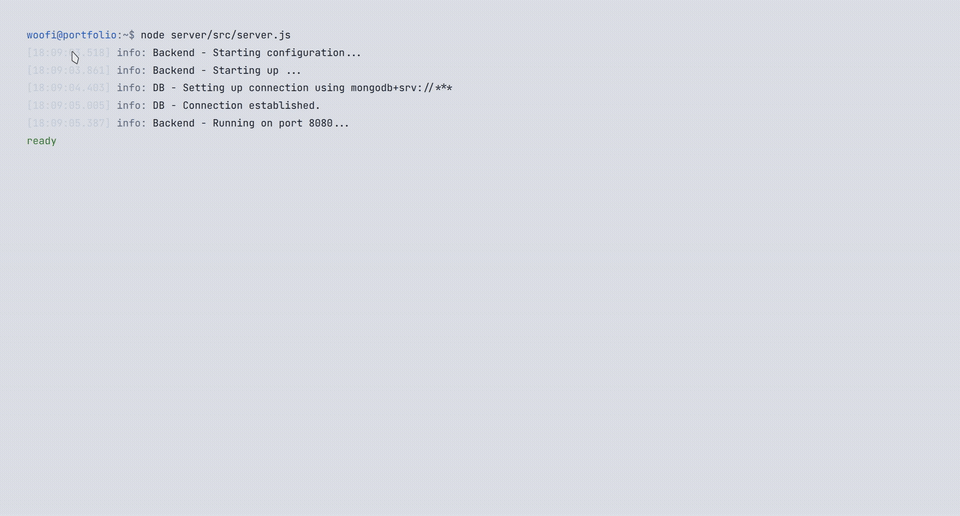
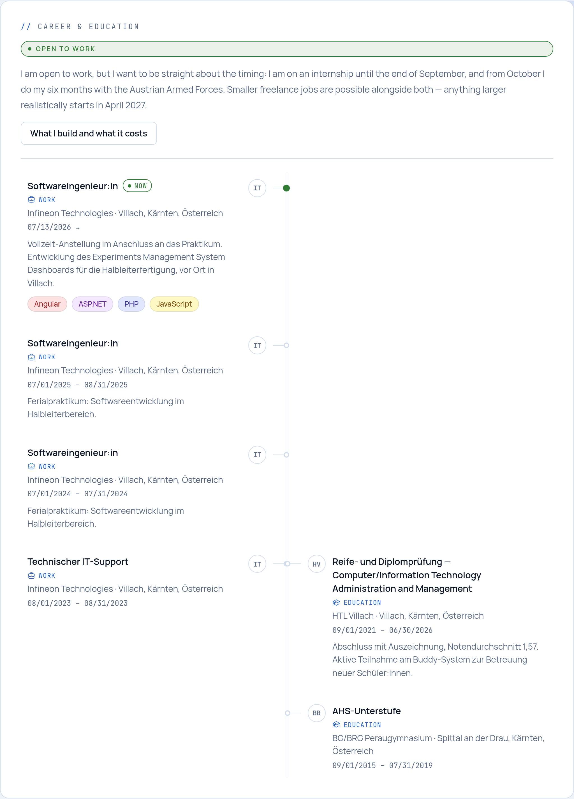
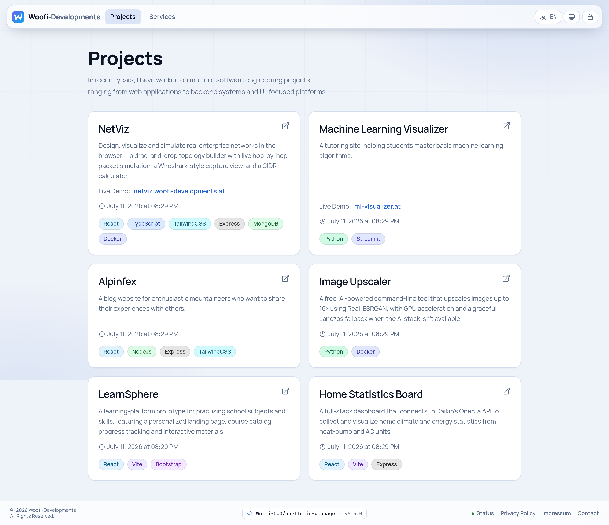
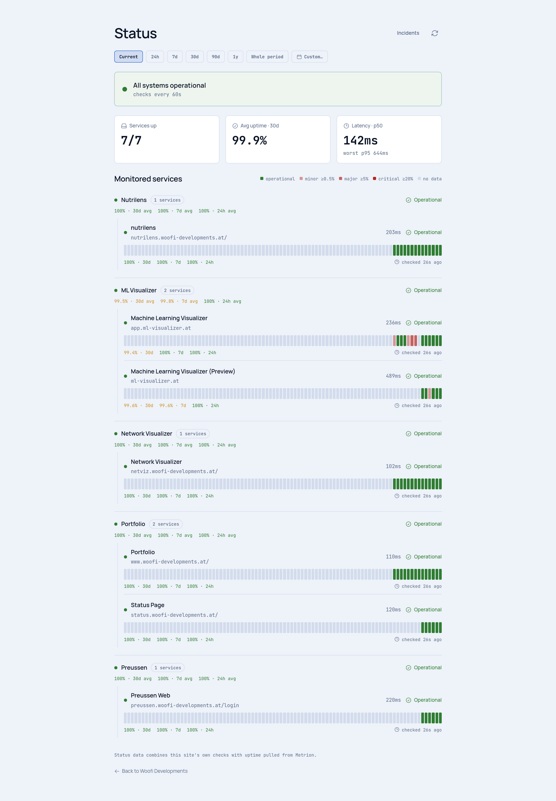
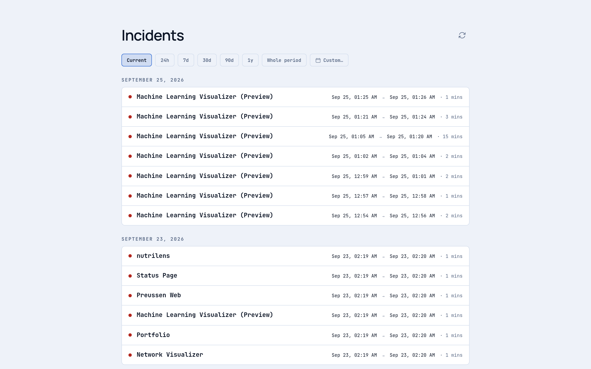
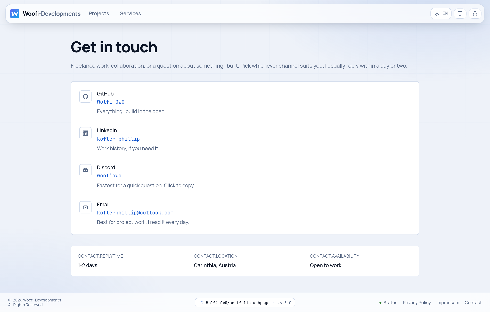

<div align="center">

# Woofi Developments — Portfolio Website

My personal developer portfolio: projects, skills, background, and a live status page for monitoring uptime.

[](https://github.com/Wolfi-OwO/portfolio-webpage/actions/workflows/linting.yml)
[](https://github.com/Wolfi-OwO/portfolio-webpage/actions/workflows/ci.yml)
[](https://github.com/Wolfi-OwO/portfolio-webpage/releases/latest)
[](https://github.com/Wolfi-OwO/portfolio-webpage/actions/workflows/secret-detection.yml)
[](./LICENSE)


Live at [woofi-developments.at](https://woofi-developments.at) — status at [status.woofi-developments.at](https://status.woofi-developments.at)




<sub>The clip above is 50 fps — the ceiling GIF can actually hold. The same walkthrough recorded at a true 60 fps: <a href="documentation/screenshots/demo.mp4">MP4</a> · <a href="documentation/screenshots/demo.webm">WebM</a></sub>

</div>

## Features

### Home


- A profile card that doubles as a service card: it reads the same `/api/status` the status page uses, so the hero reports this site's own live uptime instead of hand-written stats.
- Social links for GitHub, LinkedIn, Discord and email — Discord copies the handle, since a Discord username isn't a URL.

### Career



- A timeline of work and education blocks on the homepage, drawn from `startDate`/`endDate` on each entry rather than a hand-maintained "current" flag — which block reads as ongoing is decided by today's date.
- Backed by the same `/api/availability` collection that drives the availability badge next to it, filtered to the career track (`?track=career`); admin-only inline add/edit/delete.

### Projects



- Bilingual (EN/DE) UI with light/dark/system theme switching.
- Project showcase backed by a CRUD API — title, description, repo/live-demo links, color-coded technology tags.
- Admin-only inline editing: sign in and add/edit/delete projects directly from the page.

### Services


- What I offer, grouped into web/mobile/desktop/other, each with its deliverables, starting price and hourly rate.
- Backed by its own CRUD API (`/api/services`); admin-only inline add/edit/delete, same pattern as Projects.

### Live Status Page



- Checks run 24/7 in a separate Azure Function (Timer trigger, once a minute) that writes each result to MongoDB; this web app only _reads_ that history. MongoDB keeps a rolling 90-day window — the 24h/7d/30d figures below live entirely inside it — but up/down and response time are also copied into Metrion, a second, self-hosted system of mine with no fixed deletion date, so the availability history survives past 90 days there.
- Per monitor, the checker either sends a plain HTTP ping (this site's own domains, now on the VPS) or reads the app's state straight from the Azure control plane — never over HTTP — for whatever still runs as an Azure Container App, because a request would wake a scale-to-zero app.
- A scale-to-zero app that's idle shows as **Idle**, not Down — it's healthy and available on demand, so it doesn't dent uptime.
- Public, Discord-style status page served on its own `status.` subdomain from a separate, minimal Vite bundle — visiting it doesn't download the whole app just to show uptime.
- Per-monitor 24h / 7d / 30d uptime percentages and a scrolling history bar.

### Incidents



- A dedicated `/incidents` page on the status bundle, listing every recorded incident across all monitors, newest first and grouped by day — drawing on the same combined MongoDB + Metrion history as the status page, so an incident older than MongoDB's 90-day window still shows up.

### Contact



- One card per channel: email, GitHub, LinkedIn and Discord, plus response time and availability at a glance.

## Why it is built this way

- The status checker is decoupled from the reader: a separate Azure Function writes every check, and this app only reads the history it produces — so a checker crash or slowdown never blocks the site.
- Whatever still lives as an Azure Container App is checked from the control plane, never over HTTP, because a request would wake a scale-to-zero app and defeat the reason it's checked that way.
- Idle is not Down for a scale-to-zero app — it's healthy and available on demand, so idle time doesn't count against uptime.
- The status page ships as its own bundle on the `status.` subdomain, so visiting it never costs downloading the full portfolio app.

## Tech stack

The website is built using the following technologies:

- React (JavaScript) for the frontend, built with Vite and styled with Tailwind CSS
- Node.js / Express for the backend API, MongoDB (Mongoose) for storage
- Deployed on a Contabo VPS behind Caddy, as blue-green Docker Compose containers (`web-blue` / `web-green`) — Caddy terminates TLS and reverse-proxies to whichever slot is currently live
- The uptime-check job still runs as a separate Azure Function App

## Getting started

To run the website locally, follow these steps:

1. Clone the repository:

   ```bash
   git clone https://github.com/Wolfi-OwO/portfolio-webpage.git
   cd portfolio-webpage
   ```

2. Install dependencies — `application/` is an npm workspace covering `server` and `client`, so one install covers both:

   ```bash
   cd application
   npm install
   ```

3. Start the mongo database (docker):

   ```bash
   docker run -d -p 27017:27017 --name portfolio-mongo mongo
   ```

4. Build the client application (from `application`):

   ```bash
   npm run build
   ```

5. Start the server (from `application`):

   ```bash
   npm start
   ```

In order to test the backend, you can run the tests using (from `application/server`):

1. Start the mongo database (docker):

   ```bash
   docker run -d -p 50000:27017 --name portfolio-mongo-test mongo
   ```

2. Run the tests:

   ```bash
   npm test
   ```

## Project structure

Everything that runs lives under `application/`, which is an npm workspace. It holds three independent deployables — `server/` (the Express API), `client/` (the React frontend) and `jobs/` (Azure Functions on a timer) — each with its own `package.json`.

```txt
├── application
│   ├── package.json          workspace root — tooling only, no application code
│   ├── package-lock.json     one lockfile for server + client
│   ├── dockerfile
│   ├── docker-compose.yaml
│   ├── docker-compose.prod.yaml  the VPS stack — Caddy + blue-green web-blue/web-green
│   ├── Caddyfile              production reverse-proxy config for the VPS
│   ├── scripts
│   │   └── sync-version.mjs  stamps the git tag into every package.json
│   ├── server
│   │   ├── src
│   │   │   ├── database
│   │   │   ├── handlers
│   │   │   ├── middlewares
│   │   │   ├── models
│   │   │   ├── routes
│   │   │   ├── utils
│   │   │   └── server.js
│   │   ├── tests
│   │   └── package.json
│   ├── client
│   │   └── package.json
│   └── jobs
│       ├── src/functions     checkMonitors, syncContributions
│       ├── package.json
│       └── package-lock.json its own — see below
├── .github                   workflows, issue/PR templates, dependabot
├── CONTRIBUTING.md
├── LICENSE
└── README.md
```

**Why `jobs/` is not in the workspace.** `server` and `client` share one install and one lockfile — they are built together into a single image. `jobs` is deliberately left out: the Azure Functions deploy zips that folder _including its `node_modules`_, and a hoisted workspace install would hand Azure a package with no dependencies in it. So it keeps its own lockfile and is installed on its own (`npm ci --prefix jobs`).

**How `jobs/` actually deploys today.** The web app (`server` + `client`) moved to the Contabo VPS and runs there as blue-green Docker Compose containers behind Caddy. `jobs/` did not move with it — it still deploys as a native Azure Function App (`woofi-monitor-checker`, `functionapp,linux`, zip deploy), separate from any container image. `docker-compose.prod.yaml` on the VPS carries a matching `jobs` service, but it is disabled (`profiles: ['jobs']`) because no `portfolio-jobs` image has ever been pushed to the registry — it starts the moment one exists and that key is removed. Each check the Function performs is either a plain HTTP ping (for anything that has moved off Azure, like this site itself) or a read of the Azure control plane (for anything still running as a Container App) — see `resolveCheckMode` in `application/jobs/src/functions/checkMonitors.js`.

- `server/src/database/`: MongoDB connection setup and demo-data seeding
- `server/src/handlers/`: Request handlers for the backend
- `server/src/middlewares/`: Auth, error-handling and other Express middleware
- `server/src/models/`: Mongoose data models and schemas
- `server/src/routes/`: API route definitions
- `server/src/utils/`: Utility functions and helpers (logging, health checks)
- `server/src/server.js`: Entry point for the backend server — also serves `client/dist`
- `server/tests/`: Unit and integration tests
- `client/`: The React frontend (Vite, Tailwind, react-intl)
- `jobs/`: Azure Functions (Timer Triggers) — uptime pings/control-plane checks for the status page, and the GitHub/GitLab contribution sync the heatmap reads from
- `dockerfile`: Builds the backend image. The build context is `application/`, so it can copy the workspace lockfile, `server/` and the pre-built `client/dist`
- `docker-compose.yaml`: Local stack (web, MongoDB, Azurite, jobs) — run `docker compose` from `application/`
- `docker-compose.prod.yaml`: The VPS stack — Caddy, `web-blue`/`web-green`, Azurite, and the (currently disabled) `jobs` service
- `scripts/sync-version.mjs`: Writes the release tag into every `package.json`, so the four never drift apart

## API reference

The HTTP API is RESTful (HATEOAS `_links` on every JSON response, correct verbs and status codes, `HEAD`/`OPTIONS` on every route) with JWT-based `Bearer` authorization for writes and admin routes. Most reads are public — `/api/projects`, `/api/technologies`, `/api/services`, `/api/availability`, `/api/activity`, `/api/status` and `/api/secret/voucher` (with the right token) — while `/api/monitors` and every create/update/delete route require an admin token. Full endpoint-by-endpoint documentation, with real example requests and responses, lives in [documentation/backend/api.md](documentation/backend/api.md).

## Documentation

- [documentation/backend/api.md](documentation/backend/api.md) — full HTTP API reference (every endpoint, request/response shape, and example)
- [CONTRIBUTING.md](CONTRIBUTING.md) — development workflow and PR conventions
- [SECURITY.md](SECURITY.md) — security model and how to report a vulnerability
- [documentation/deployment/previews.md](documentation/deployment/previews.md) — how PR preview deployments work

## License

Released under the **MIT License** — see [LICENSE](./LICENSE).

The commissioned artwork in `application/client/public/wolfi-*` is **not** covered by the MIT License. It is copyright of its artist and is used here with permission; copying, modifying or redistributing it needs the artist's own consent. See the notice at the end of [LICENSE](./LICENSE).
